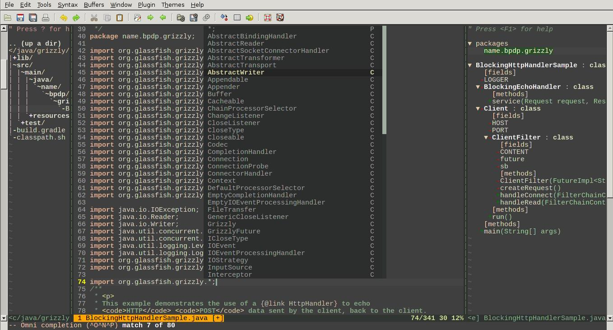

Vim for Java Development
========================

A skeleton of Vim for Java Development with Gradle. This is shell-oriented thing, probably not of your taste. If you prefer doing Java development mostly in terminal/shell, you will feel right at home. I use [GNU Bash](http://www.gnu.org/software/bash/). You may make any adjustment in `classpath.sh` and `source classpath.sh` command below if you use other shells (tcsh, zsh, ksh, /etc).

License
-------

I don't take credit for all Vim plugins described here. I only put them in one place and explain what you can do to use them effectively for Java development. See the website of all plugins here to know the license.

Here's How
----------

* You have [Gradle](http://gradle.org) [installed and run correctly](http://www.gradle.org/docs/current/userguide/installation.html), right?
* Using Vim for all development tasks is cool, but even cooler if you use [Pathogen](https://github.com/tpope/vim-pathogen). If you don't, well, you should...
* Put all these plugins in `$HOME/.vim/bundle` just as Pathogen told you (see also `$HOME/.vim/vimrc` below):

		* [vim-gradle](https://github.com/tfnico/vim-gradle)
    * [indentLine](https://github.com/Yggdroot/indentLine)
    * [javacomplete](https://github.com/adragomir/javacomplete) 
    * [syntastic](https://github.com/scrooloose/syntastic)
    * [tagbar](https://github.com/majutsushi/tagbar)
    * [nerdtree](https://github.com/scrooloose/nerdtree)
    * [vim-colorschemes](https://github.com/flazz/vim-colorschemes) - life isn't beautiful without color :p
    * [vim-smartusline](https://github.com/molok/vim-smartusline)

* Put all of the Gradle dependencies into build.gradle then issue `gradle build`. That way, all of dependencies will be downloaded in `$HOME/.gradle`. See `build.gradle` file for example, or if you want, you may open [Dependency Management chapter](http://www.gradle.org/docs/current/userguide/artifact_dependencies_tutorial.html) in Gradle manual.
* Issue command `gradle copyToLib` to copy all of the dependencies into lib dir
* Issue command `source classpath.sh`
* gvim, and you are on your way.
* Use `:TagbarOpen` if you want to open tagbar for active Java source code 
* You may use Omni Completion also, like `import org.<C-X><C-O>`. When I say `<C-X>`, it means you press `Ctrl with X`.

$HOME/.vim/vimrc
----------------

    execute pathogen#infect()
    
    set nocompatible
    syntax on
    filetype plugin indent on
    set ofu=syntaxcomplete#Complete
    
    if has("gui_running")
      colorscheme zenburn
    else
      colorscheme slate
    endif
    
    set smartindent
    set tabstop=2
    set shiftwidth=2
    set expandtab
    set cursorline
    
    " Default Colors for CursorLine
    highlight  CursorLine ctermbg=Yellow ctermfg=None
    
    " Change Color when entering Insert Mode
    autocmd InsertEnter * highlight  CursorLine ctermbg=Darkgray ctermfg=Red
    
    " Revert Color to default when leaving Insert Mode
    autocmd InsertLeave * highlight  CursorLine ctermbg=Yellow ctermfg=None
    
    autocmd vimenter * NERDTree
    autocmd vimenter * if !argc() | NERDTree | endif
    autocmd bufenter * if (winnr("$") == 1 && exists("b:NERDTreeType") && b:NERDTreeType == "primary") | q | endif
    
    let g:NERDTreeDirArrows=0
    let g:NERDTreeWinSize = 15
    
    au BufRead,BufNewFile *.gradle set filetype=groovy
    
    let g:cssColorVimDoNotMessMyUpdatetime = 1
    set guifont=Liberation\ Mono\ 11
    
    set number
    set numberwidth=4
    set cpoptions+=n
    highlight LineNr term=bold cterm=NONE ctermfg=DarkGrey ctermbg=NONE gui=NONE guifg=DarkGrey guibg=NONE
    
    
    set grepprg=grep\ -nH\ $*
    let g:tex_flavour = "latex"
    
    set foldmethod=indent
    set foldnestmax=2
    
    " vertical line indentation
    let g:indentLine_color_term = 239
    let g:indentLine_color_gui = '#09AA08'
    " let g:indentLine_color_gui = '#A4AAAA'
    let g:indentLine_char = '│'
    
    hi Modified guifg=black guibg=#FFA500
    set statusline=%2.2n\ %t\ %h%#Modified#%m%r%*%=%l/%L\ %2c\ %P
    let g:smartusline_string_to_highlight = '%2.2n %t %h'
    
    au BufNewFile,BufRead *.groovy  setf groovy 
    au BufNewFile,BufRead *.gradle  setf groovy 
    
    if has("autocmd") 
      autocmd Filetype java setlocal omnifunc=javacomplete#Complete 
    endif 
    
    setlocal completefunc=javacomplete#CompleteParamsInfo 

Screenshots?
------------

See here if you are difficult to be convinced :p

Author
------
[Bambang Purnomosidi D. P.](http://bpdp.name)
* Email: bambangpdp-with-domain-name-yahoocom-or-gmailcom
* Facebook: [/bambangpdp](http://www.facebook.com/bambangpdp)
* Twitter: [@bpdp](http://twitter.com/bpdp)
